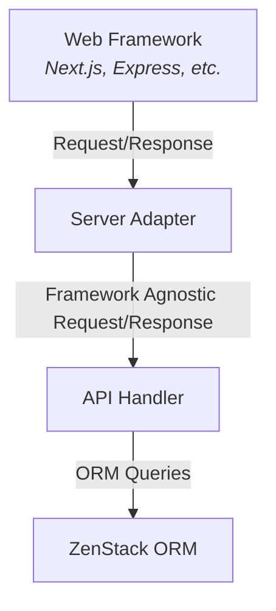

# Server Adapter

## Overview

Server adapters are components that handle the integration with specific frameworks. They understand how to install API routes and handle framework-specific request and response objects.

Server adapters need to be configured with an API handler that defines the API specification. The following diagram illustrates the relationship between them:



## Example

Let's use a real example to see how API handlers and server adapters work together to serve an automatic secured data query API. A few notes about the example:

- [Express.js](https://expressjs.com/) is used to demonstrate, but the same concept applies to other supported frameworks.
- Authentication is simulated by using the "x-userid" header. In real applications, you would use a proper authentication mechanism.
- ZModel schema is configured with access policies.
- For each request, the `getClient` call back is called to get an ORM client instance bound to the current user.

> **Info**

After the server launches in the interactive playground, open a new terminal and run `npm run client` to test the API.

**`main.ts`**

```typescript
import type { ClientContract } from '@zenstackhq/orm';
import { RPCApiHandler } from '@zenstackhq/server/api';
import { ZenStackMiddleware } from '@zenstackhq/server/express';
import express, { Request } from 'express';
import { createClient } from './db';
import { schema, type SchemaType } from './zenstack/schema';

const app = express();
const port = 3000;

// initialize the ORM client
let client: ClientContract<SchemaType> | undefined;
createClient().then(_client => {
  client = _client;
});

app.use(express.json());

// install ZenStack's CRUD service at "/api/model"
app.use(
  '/api/model',
  ZenStackMiddleware({
    // use RPC API handler
    apiHandler: new RPCApiHandler({ schema }),

    // `getClient` is called for each request to get a proper
    // ORM client instance
    getClient: (request) => getClient(request),
  })
);

app.listen(port, () => {
  console.log(`App listening on port ${port}`)
  console.log('Run `npm run client` to test the service');
});

async function getClient(request: Request) {
  // here we use the "x-userid" header to simulate user authentication, in a
  // real application, you should use a proper auth mechanism
  const uid = request.get('x-userid');
  if (!uid) {
    // returns the client unbound to a specific user (anonymous)
    console.log('Using anonymous ORM client');
    return client!;
  } else {
    // return a user-bound client
    console.log('Using ORM client bound to user:', uid);
    return client!.$setAuth({id: parseInt(uid)})
  }
}
```

**`zenstack/schema.zmodel`**

```zmodel
datasource db {
    provider = 'sqlite'
}

plugin policy {
    provider = '@zenstackhq/plugin-policy'
}

/// User model
model User {
    id       Int    @id @default(autoincrement())
    email    String @unique
    posts    Post[]

    // everybody can signup, profiles are public
    @@allow('create,read', true)

    // user himself has full access
    @@allow('all', auth() == this)
}

/// Post model
model Post {
    id        Int      @id @default(autoincrement())
    title     String
    published Boolean  @default(false)
    author    User?    @relation(fields: [authorId], references: [id])
    authorId  Int?

    // no anonymous access
    @@deny('all', auth() == null)

    // published posts are readable to all
    @@allow('read', published)

    // author has full access
    @@allow('all', auth() == author)
}
```

## Catalog

ZenStack currently maintains the following server adapters. New ones will be added over time based on popularity of frameworks.

- [Next.js](../reference/server-adapters/next)
- [Nuxt](../reference/server-adapters/nuxt)
- [SvelteKit](../reference/server-adapters/sveltekit)
- [TanStack Start](../reference/server-adapters/tanstack-start)
- [Express.js](../reference/server-adapters/express)
- [Fastify](../reference/server-adapters/fastify)
- [Hono](../reference/server-adapters/hono)
- [Elysia](../reference/server-adapters/elysia)
